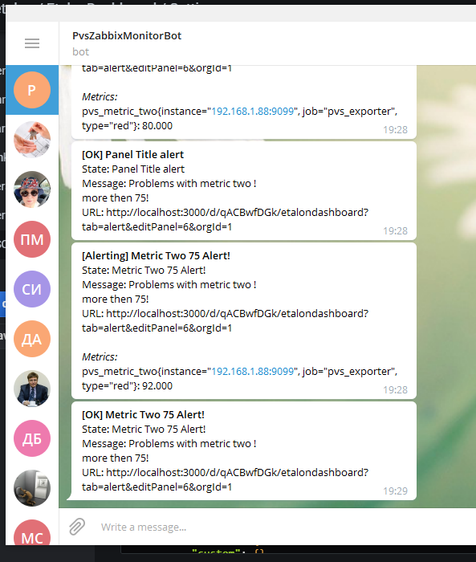

# otus-lab-4
Формирование dashboard на основе собранных данных с Prometheus
использовать графану zabbix.systemctl.su
создать своего пользователя
создать свой team
разрешить доступ к своей дашборде только своей team
подключить свой прометеус со своим экпортером к графане
создать свою папку
создать свой дашбоард на основе метрик со своего экспортера
настроить threshold
настроить alert в телеграм канал (указан в ДЗ про алертинг с заббикса)
сделать снэпшот

Как результат ДЗ прислать ссылку на снэпшот, ссылку на дашборду
по просьбе преподавателя уметь пересоздать дашборду из сохраненнного json

1. Создал 2х пользователей pstrokov и invest.
2. Создал команду Etalon и включил в неё созданных пользователей.
3. Создал папку etalon
4. В папке etalon создал dashboard EtalonDashboard
5. Ограничил доступ группой etalon.
6. Себе назначил админские права, пользователю invest только просмотр.
7. Подключил свой источник данных prometheus под именем Etalon.
8. Сделал в своём dashboard 4 панельки. 2 из стандартных экспортеров, 2 своих.
9. Для одной из метрик настроил treshhold на уровне 75 (метрика рандомна от 0 до 100)
10. Настроил канал telegram для отправки уведомлений PvsZabbixMonitorBot
11. Сделал snapshot на момент срабатывания триггера
[http://zabbix.systemctl.su/dashboard/snapshot/ZyANRfM1eulLWUYLkR14Z1PYvxVEJ3CP](http://zabbix.systemctl.su/dashboard/snapshot/ZyANRfM1eulLWUYLkR14Z1PYvxVEJ3CP)

# Скриншот из telegram

Ссылка на dashboard [http://zabbix.systemctl.su/d/qACBwfDGk/etalondashboard?orgId=1&refresh=10s&from=1600359461488&to=1600360361488](http://zabbix.systemctl.su/d/qACBwfDGk/etalondashboard?orgId=1&refresh=10s&from=1600359461488&to=1600360361488)

Настроенный dashboard сохранил в json файл [dashboard.json](dashboard.json) на случай если нужно восстановить или создать копию.
